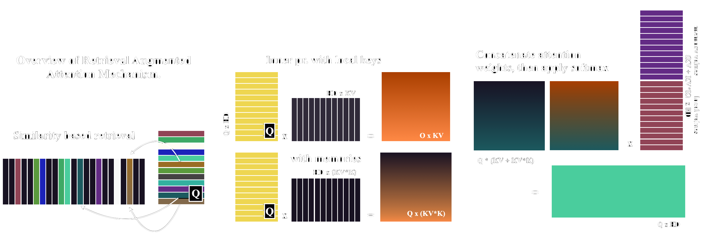
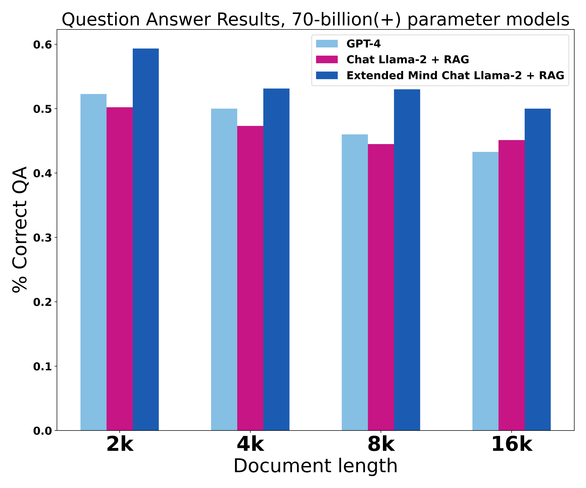
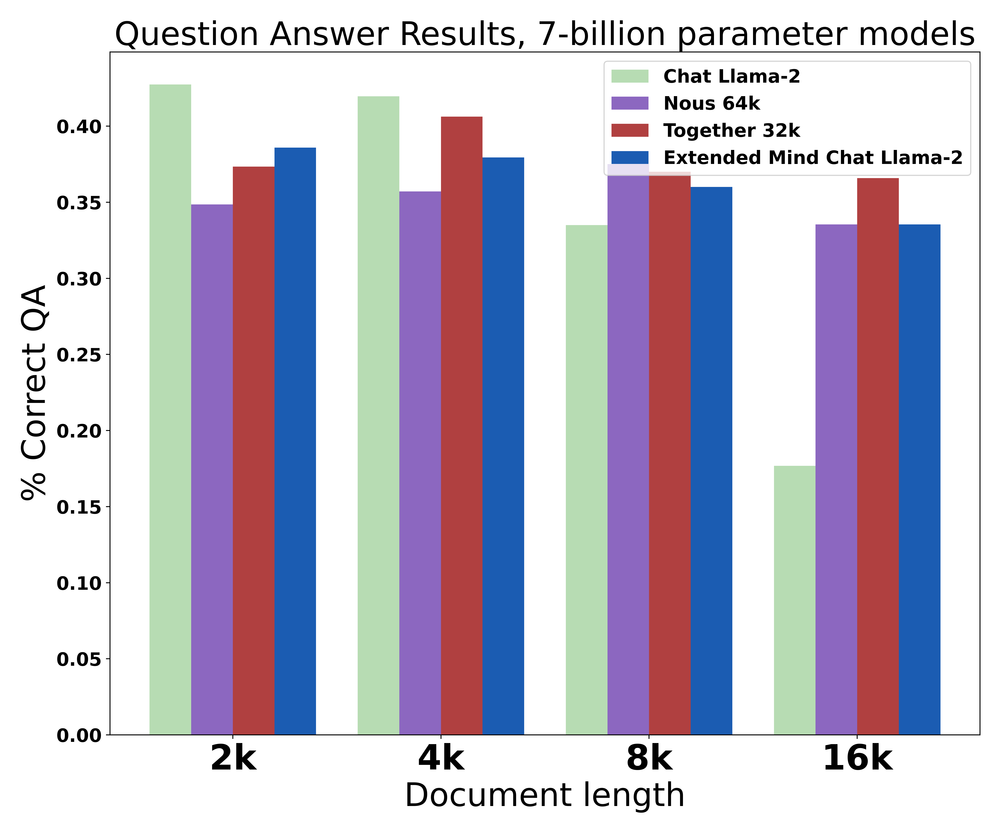
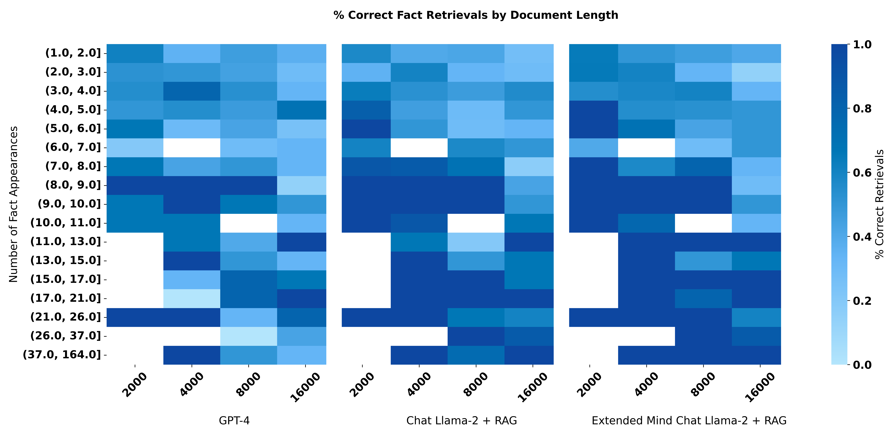

<p align="center" width="100%"></p>

# Extended Mind Transformers: Long Context without Finetuning


<div align="center">

<table>
  <tr>
    <th> <a href="https://huggingface.co/normalcomputing/extended-mind-llama-2-7b-chat">Extended Mind Chat Llama-2-7b</a> </th>
    <th> <a href="https://huggingface.co/normalcomputing/extended-mind-mpt-7b">Extended Mind Chat MPT-7b</a></th>
  </tr>
  <tr>
    <td align="center">
    <a  href="https://colab.research.google.com/github/normal-computing/extended-mind-transformers/blob/main/demo_llama.ipynb"></a>
    </td>
    <td align="center">
    <a href="https://colab.research.google.com/github/normal-computing/extended-mind-transformers/blob/main/demo_mpt.ipynb"></a>
    </td>
 </tr>
</table>

</div>

<div align="center">

 [TLDR](#TLDR) | [Overview](#Overview) | [Usage](#Usage) | [Extended Mind Transformer performance](#Extended_Mind_Transformer_performance) | [Authors](#Authors) | [Citation](#Citation) | [License](#License)

</div>

## TLDR
This is the official implementation of [Extended Mind Transformers](https://arxiv.org/abs/2406.02332). We open-source a [collection](https://huggingface.co/collections/normalcomputing/extended-mind-transformers-6655e9ba5853d86b32793aaf) of Extended Mind Transformers, as well as a new counterfactual [long-range benchmark](https://huggingface.co/datasets/normalcomputing/wikiqa-counterfactual). 

## Overview

### Extended Mind Transformers
We present [Extended Mind Transformers](https://arxiv.org/abs/2406.02332), a variety of decoder-only transformers closely related to Memorizing Transformers [(Wu et al. 2022)](https://arxiv.org/abs/2203.08913) that retrieve and attend to an external cache of key-value pairs (or memories) without finetuning. The model decides for each token, within a particular decoder, which memories are important. The complete collection of Extended Mind Transformers includes:

<div align="center">

**Extended Mind Llama2**

[Llama-2-7B](https://huggingface.co/normalcomputing/extended-mind-llama-2-7b) | [Chat Llama-2-7B](https://huggingface.co/normalcomputing/extended-mind-llama-2-7b-chat) | [Llama-2-70B](https://huggingface.co/normalcomputing/extended-mind-llama-2-70b) | [Chat Llama-2-70B](https://huggingface.co/normalcomputing/extended-mind-llama-2-70b-chat)

**Extended Mind MPT**

[MPT-7B](https://huggingface.co/normalcomputing/extended-mind-mpt-7b) | [Chat MPT-2-7B](https://huggingface.co/normalcomputing/extended-mind-mpt-7b-chat) | [MPT-30B](https://huggingface.co/normalcomputing/extended-mind-mpt-30b) | [Chat MPT-30B](https://huggingface.co/normalcomputing/extended-mind-mpt-30b-chat)

</div>


### Generating memories

Passing external memories to the model is easy. Simply pass the token ids to the model during instantiation, as the following examples illustrate. Generating and caching the memories is handled internally, during the first `model.generate()` call. You can update the memories using the following sequence of commands:

```python
model.clear_memories()
model.memory_ids = list_of_new_token_ids
```

### Topk Attention on Memories

The retrieval-augmentation we introduce to the self-attention mechanism is quite straightforward. In addition to self-attention, we introduce top-k attention [(Gupta et al. 2021)](https://arxiv.org/abs/2106.06899) over the cached key-value pairs. I.e., we allow each query token to attend to a certain number of external key-value pairs where the cosine similarity between the query and key is largest. The retrieval-augmented attention mechanism can be described by the following equations:

<div align="center">

scores = $\frac{K_{R}}{\mid \mid K_{R} \mid \mid} \times \frac{Q}{\mid \mid Q \mid \mid}$  $\hspace{.3cm}$ ,  $\hspace{.3cm}$  $\text{softmax}\left(\frac{Q(K_{M}\oplus K_{L})^{T}}{\sqrt{d}}\right) \times \left(V_{M} \oplus V_{L}\right)$

</div>

where $\oplus$ refers to tensor concatenation, $(K_{L}, V_{L})$ are key-value pairs from local context, $(K_{R}, V_{R})$ are all key-value pairs from external memories, and $(K_{M}, V_{M})$ are those $k$ key-value pairs with largest score. As usual, $Q$ are queries, and $d$ is head dimension.

The following figure provides a visual aid for how self-attention is combined with top-k attention over external memories. 

<div align="center">



</div>

## Usage

### Set up
- Install conda as specified here: https://docs.anaconda.com/free/miniconda/#quick-command-line-install
- Create Environment: ``conda create --name emt_env python=3.11``
- Activate Environment: ``conda activate emt_env``
- Install packages: ``python -m pip install -r requirements.txt``

### Data set up
Everything should run from root: ``PYTHONPATH=. python``

Run `experiments/data/wikiqa-edit.py` to download and preprocess the WikiQA dataset.

### Loading model, handling memories

Load any of the above models with the usual huggingface `.from_pretrained()` method. Since we use custom modeling code, set `trust_remote_code=True` to avoid warnings. Pass the memories to the model as a list of token ids.

```python
from transformers import AutoModelForCausalLM, AutoTokenizer

ag_wiki_entry = """Alexander Grothendieck (/ˈɡroʊtəndiːk/; German pronunciation: [ˌalɛˈksandɐ ˈɡʁoːtn̩ˌdiːk] (listen); French: [ɡʁɔtɛndik]; 28 March 1928 – 13 November 2014) was a stateless (and then, since 1971, French) mathematician who became the leading figure in the creation of modern algebraic geometry.[7][8] His research extended the scope of the field and added elements of commutative algebra, homological algebra, sheaf theory, and category theory to its foundations, while his so-called "relative" perspective led to revolutionary advances in many areas of pure mathematics.[7][9] He is considered by many to be the greatest mathematician of the twentieth century.[10][11]"""

tokenizer_hf = AutoTokenizer.from_pretrained("normalcomputing/extended-mind-llama-2-7b")
memories = tokenizer_hf(ag_wiki_entry).input_ids

model_hf = AutoModelForCausalLM.from_pretrained("normalcomputing/extended-mind-llama-2-7b", external_memories=memories, trust_remote_code=True)
```
After this, you can generate text with the model as usual. The model will automatically use the memories during generation. You can update any config parameters (we set `topk` below) by passing new values to the `model.generate()` method.

```python
inputs = "When did Alexander Grothendieck become a French citizen?"
inputs = tokenizer(inputs, return_tensors="pt").input_ids

outputs = model.generate(inputs, max_length=40, topk=2)
tokenizer.decode(outputs_hf['sequences'][0], skip_special_tokens=True)
```

### Citations

By simply setting `output_retrieved_memory_idx=True` in the `model.generate()` method, you can retrieve the memory indices used during generation. We walk through an example in the [demo notebook](). 


### Additional configuration
LongLLaMA has several other parameters:
* `memory_type` (`string`, *optional*, defaults to `manual`):
            Whether to store external memories manually or in a vector database.
* `mask_by_sim` (`bool`, *optional*, defaults to `True`):
    Whether or not to mask retrieved memories by similarity.
* `sim_threshold` (`float`, *optional*, defaults to `0.25`):
    Threshold for masking retrieved memories.
* `tokenizer_all_special_ids` (`list`, *optional*, defaults to `[0, 50278]`):
    Ids for special tokens to remove from memories.
* `remove_special_tokens` (`bool`, *optional*, defaults to `True`):
    Remove memories that correspond to tokenizer special ids.

Additionally, the stride used to compute the memory representations can be set within `generate_cache()` method. Smaller strides generate higher-quality representations, while larger strides require fewer computations.


### Running Experiments

Experiments should be run using the pattern:
``PYTHONPATH=. python /path/to/run_experiment.py --base /path/to/config.yaml``

Example:
``PYTHONPATH=. python ./experiments/run_retrieval.py --base ./experiments/configs/extended-llama-retrieval-70b.yaml``

If running OpenAI models (including embeddings for RAG), run this from your terminal first: 
```
export openai_key="your_key_here"
export openai_org="your_org_here"
```

## Long-range Counterfactual Retrieval Benchmark

Our new benchmark is a modified [wikiQA benchmark](https://huggingface.co/datasets/abacusai/WikiQA-Free_Form_QA), which can be accessed [here](https://huggingface.co/datasets/normalcomputing/wikiqa-counterfactual). The dataset is composed of Wikipedia articles (of 2-16 thousand tokens) and corresponding questions. We modify the dataset by changing the labeled answers to realistic but wrong answers, to control for facts memorized during pre-training. For example, we replace every instance of "Lee Hazlewood" with "Terry Allen" in the Wikipedia entry for the song "These Boots Were Made For Walking", and then ask the model to produce the songwriter's name, with the correct answer now being "Terry Allen". More detail on the dataset creation can be found in the paper. 

## Extended Mind Transformer performance
We summarize the performance of Extended Mind Transformers on our long-range counterfactual retrieval benchmark. Extended Mind Transformers are competitive with fine-tuned models on long inputs, and outperform them on short inputs. Extended Mind Transformers combined with RAG outperform GPT-4 by a large margin, $6\%$ when averaged across input lengths. Check out the [paper]() for a full treatment. 

<table>
  <tr>
    <td style="width: 50%; text-align: center;">
      
    </td>
    <td style="width: 50%; text-align: center;">
      
    </td>
  </tr>
</table>


<div align="center">
Retrieval results for all models.

|Model | 2k | 4k | 8k | 16k |
| --- | --- | --- | --- | --- |
|  **7b models** |  |  |  | |
|[Extended Mind Chat Llama2-7b](https://huggingface.co/normalcomputing/extended-mind-llama-2-7b-chat) |  38.59\% | 37.95\% | 36.00 \% | 33.54\% |
|[Chat Llama2](https://huggingface.co/meta-llama/Llama-2-7b-chat-hf) | 42.74\% | 41.96\% | 33.50\% | 17.68\% |
|[Nous]()https://huggingface.co/NousResearch/Yarn-Llama-2-7b-64k | 34.85\% | 35.71\% | 37.50\% | 33.54\% |
|[Together AI](https://huggingface.co/togethercomputer/LLaMA-2-7B-32K/blob/main/config.json)|  37.34\% | 40.63\% | 37.00\% | 36.59\% |
|  **70b+ models** |  |  |  | |
|[Extended Mind Chat Llama2-70b](https://huggingface.co/normalcomputing/extended-mind-llama-2-70b-chat) + RAG | **59.34\%** | **53.13\%** | **53.00\%** | **50.00\%**| 
|[Chat Llama2-70b](https://huggingface.co/meta-llama/Llama-2-70b-chat-hf) + RAG |  50.21\% | 47.32\% | 44.50\% | 45.12\% |
|GPT-4 | 52.28\% | 50.00\% | 46.00\% | 43.29\% |

<br>
</div>

We can also stratify the results by the number of times the fact appears in the document.
In this plot, each cell represents samples where the number of fact appearances falls within the range specified on the x-axis, and is colored to represent the overall success of the retrievals. The results are further stratified by sequence length, on the y-axis.  Intuitively, if the fact appears many times, it should be easier to retrieve.

<div align="center">
<br>


</div>


## Authors
- [Phoebe Klett](https://arxiv.org/search/cs?searchtype=author&query=Klett,+P)
- [Thomas Ahle](https://scholar.google.dk/citations?user=aRiVoYgAAAAJ&hl=en)


## Citation
To cite this work please use
```bibtex
@misc{klett2024extended,
      title={Extended Mind Transformers}, 
      author={Phoebe Klett and Thomas Ahle},
      year={2024},
      eprint={2406.02332},
      archivePrefix={arXiv},
      primaryClass={cs.LG}
}
```

## Sources, License
Our source code is liscensed under [Apache License, Version 2.0](http://www.apache.org/licenses/LICENSE-2.0). The models and dataset are for research purposes only. Our source code is based on code written by teams at Meta and Mosaic ML, and inherits their liscenses as specified in the code. We annotate where changes have been made. 
